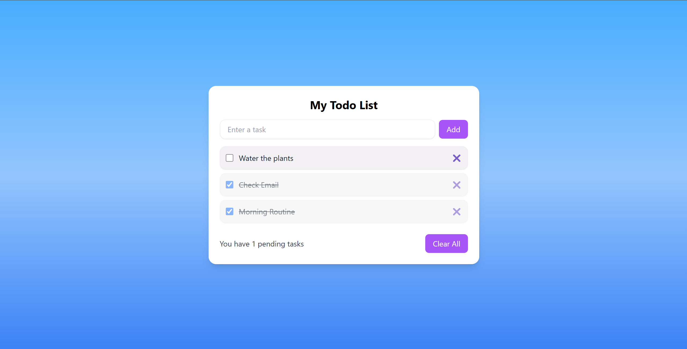

# 📝 Todo App

A sleek and modern Todo List app built using **React**, **Tailwind CSS**, and **Vite**.  
This app helps users manage daily tasks with a clean interface, checkbox functionality, delete options, and subtle animations for better UX.

---

## 🚀 Features

- ✅ Add new tasks
- ✅ Mark tasks as completed
- 🗑️ Delete individual tasks
- 🎯 Clear all tasks at once
- 🎨 Stylish UI with Tailwind CSS
- ✨ Animated task transitions using Framer Motion
- 🌈 Gradient background for clean aesthetic
- ⚛️ Built with React functional components & hooks

---

## 📸 Screenshot


> Tip: Add your own screenshot or GIF showing the app in action

---

## 🛠️ Tech Stack

- [React](https://reactjs.org/)
- [Tailwind CSS](https://tailwindcss.com/)
- [Vite](https://vitejs.dev/)
- [Framer Motion](https://www.framer.com/motion/) (for animations)

---

## 🧑‍💻 Getting Started

### 1. Clone the repo

```bash
git clone https://github.com/your-username/react-todo-app.git
cd react-todo-app

npm install

npm run dev
